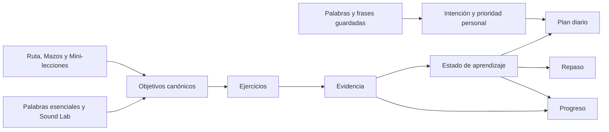

# Ciclo integrado de aprendizaje

**Estado:** contrato canónico de producto y arquitectura

**Fecha:** 2026-08-10

Este documento define cómo se conectan el Plan diario, Laboratorio de sonidos,
Palabras esenciales, Mazos, Ruta, Mini-lecciones, contenido guardado, Repaso y
Progreso. La conexión se realiza mediante objetivos y evidencia compartidos;
no mediante enlaces circunstanciales entre pantallas.

## Principio central

> Cada contenido declara qué enseña; cada ejercicio produce evidencia; Plan
> diario y Repaso deciden qué practicar; Progreso interpreta la evidencia sin
> inventarla.

La app debe sentirse como un solo ciclo:

1. El usuario descubre o estudia un contenido.
2. Practica uno o más objetivos concretos.
3. La app registra evidencia con identidad y modalidad explícitas.
4. El estado del objetivo cambia según la política de su dominio.
5. Plan diario o Repaso vuelven a presentar lo que corresponde.
6. Progreso explica qué se hizo, qué se retiene y qué falta comprobar.

## Señales que no se deben confundir

| Acción | Señal válida | Lo que no demuestra |
|---|---|---|
| Abrir o leer contenido | Exposición | Comprensión o dominio |
| Terminar una lección | Cobertura/completion | Retención del concepto |
| Guardar una palabra, frase o lección | Intención personal | Que el usuario ya la sabe |
| Marcar algo como conocido | Familiaridad declarada | Dominio objetivo |
| Resolver un ejercicio | Evidencia objetiva de una modalidad | Dominio general en todas las modalidades |
| Acertar después de un intervalo | Retención | Transferencia espontánea |
| Usar el objetivo en una frase o situación nueva | Transferencia contextual | Precisión acústica no medida |

`saved`, `familiar`, `objective_evidence` y `mastered` permanecen separados.
Una superficie puede aportar una señal útil sin modificar mastery.

## Responsabilidad de cada superficie

| Superficie | Responsabilidad | Escritura permitida |
|---|---|---|
| Plan diario | Seleccionar las mejores acciones de hoy y explicar por qué fueron elegidas | Reconciliación de pasos y sesiones realmente completadas |
| Laboratorio de sonidos | Entrenar percepción, contraste y producción controlada | Answers, sesión y progreso del target de pronunciación evaluado |
| Palabras esenciales | Currículo, práctica y repetición espaciada de vocabulario frecuente | Evidencia y estado de sus learning items/SRS |
| Ruta | Ordenar el currículo y recomendar el siguiente objetivo | Navegación y completion explícita; nunca mastery por visitar |
| Mazos | Enseñar teoría estructurada y lanzar práctica del mismo concepto | Completion, quiz y práctica con topic canónico |
| Mini-lecciones | Ofrecer teoría complementaria breve | Completion al leer; quiz/práctica como evidencia separada |
| Guardados | Conservar intención personal y ofrecer entrada exacta a práctica | `word_bank` para palabras; `tracked_items` para frases/lecciones |
| Repaso | Ejecutar recuperación espaciada de targets vencidos, débiles o pendientes de verificación | Answers, rating y sesión; no una métrica paralela |
| Progreso | Proyectar actividad, cobertura y aprendizaje comprobado | Ninguna mutación de aprendizaje |

### Palabras esenciales y Plan diario

Estar conectados no significa compartir cuota. Palabras esenciales conserva su
sesión y presupuesto de acciones independientes. El Plan diario puede recomendar
una sesión o reutilizar evidencia/targets válidos, pero no debe restar su historial,
cuota o `introducedToday` del presupuesto interno de Palabras esenciales.

### Ruta, Mazos y Mini-lecciones

- Ruta ordena y recomienda; no crea evidencia por navegación.
- Mazos representa la experiencia principal de teoría del currículo.
- Mini-lecciones complementa el currículo y debe declarar el topic o target que
  enseña cuando existe una correspondencia real.
- `lesson_completions` responde “qué contenido terminó”; quiz, práctica y SRS
  responden “qué evidencia existe sobre lo aprendido”.

### Contenido guardado

- Una palabra guardada conserva su identidad real de `word_bank`.
- Frases y lecciones permanecen en `tracked_items`; no se duplica `word_bank`.
- Una frase solo puede modificar un target de aprendizaje cuando existe una
  referencia canónica explícita. Si no se puede resolver, puede seguir siendo
  bookmark o práctica no-SRS, pero nunca debe actualizar un target adivinado.
- Guardados/familiaridad son desempates acotados para Plan diario. No desplazan
  trabajo SRS vencido ni alteran intervalos por sí mismos.

## Identidad canónica

Toda evidencia evaluable necesita señalar exactamente qué se evaluó. Los owners
actuales siguen siendo la fuente de verdad:

| Dominio | Identidad/owner |
|---|---|
| Vocabulario personal | UUID real de `word_bank` |
| Palabras esenciales | Learning item estable del currículo, actualmente basado en `c1k:<word>` |
| Conceptos de teoría | Topic normalizado y su fila de `topic_srs` cuando corresponde |
| Pronunciación | `PronunciationTargetId` del registro canónico |
| Frases autorales del sistema | `text_fragments` u otra fuente autoral explícita |
| Frases personales | `tracked_items` como contenido; target refs explícitos para cualquier efecto de aprendizaje |
| Lecciones | Par estable `course_slug + lesson_slug` en `lesson_completions` |

Un contexto (`daily`, `courses`, `review`, `essential-words`) explica de dónde
vino la actividad. No sustituye la identidad del target. Dos ejercicios en
pantallas distintas que evalúan el mismo target deben atribuirse al mismo owner;
un ejercicio grupal debe declarar todos sus outcomes o marcarse explícitamente
como no-SRS.

## Contrato de evidencia

La unidad mínima evaluable continúa siendo `PracticeAnswer`. Debe conservar:

- identidad del ejercicio y tipo canónico;
- contexto y fuente;
- target/outcome explícito mediante attribution cuando modifica SRS;
- modalidad: reconocimiento, listening, meaning recall, producción controlada
  o transferencia contextual;
- resultado, grade y tiempo cuando sean válidos;
- señal/evaluador y confianza para producción oral.

La sesión coherente se registra una sola vez mediante `recordActivitySession`.
Las respuestas se guardan al completar cada ejercicio; el resumen de sesión no
las vuelve a insertar.

Para producción oral, el estado actual permite hablar de inteligibilidad basada
en STT y de evidencia perceptiva. No permite presentar precisión acústica de
fonemas, stress, ritmo o entonación.

## Persistencia y fuentes de verdad

| Fuente | Responsabilidad |
|---|---|
| `answer_history` | Respuestas individuales, accuracy, atribución y análisis detallado |
| `activity_sessions` | Una fila compacta por sesión, actividad reciente y volumen semanal |
| `word_bank` | Estado de palabras personales, familiaridad y SRS |
| Essential Words local stores | Learning items, attempts y scheduling propio de Palabras esenciales |
| `topic_srs` | Repetición de conceptos normalizados |
| `user_contrast_progress` y evidencia de pronunciación | Estado especializado de sonidos/targets |
| `lesson_completions` | Cobertura explícita de lecciones |
| `tracked_items` | Frases y lecciones guardadas; intención, no mastery |

El outbox mantiene las escrituras offline-first e idempotentes. Ninguna pantalla
de Progreso debe escribir de vuelta a estas fuentes.

## Política de selección

### Plan diario

El Plan diario es un orquestador, no un nuevo scheduler. Debe ordenar candidatos
con una política determinista y visible:

1. Repasos vencidos y verificaciones pendientes.
2. Errores recientes y targets débiles con evidencia suficiente.
3. Siguiente contenido de la Ruta o prescripción activa.
4. Un número acotado de guardados/familiares como prioridad personal.
5. Exploración o variedad para completar capacidad.

Cada paso debe conservar `targetIds`, fuente y motivo de selección para que la
finalización reconcilie únicamente el paso exacto.

### Repaso

Repaso ejecuta colas reales. No muestra una colección genérica ni crea un
scheduler alternativo. Debe conservar el filtro/selección solicitada, reportar
referencias inválidas y permitir que el scheduler adapte el orden dentro de la
cola cuando no cambie su contenido.

## Modelo de Progreso

Progreso es una proyección de solo lectura con tres grupos separados:

1. **Actividad:** sesiones, ejercicios, consistencia y tiempo.
2. **Cobertura:** contenidos vistos, lecciones completadas y targets encontrados.
3. **Aprendizaje comprobado:** retención, evidencia objetiva, mastery con
   provenance, debilidades y transferencia.

No se debe usar completion, guardado, racha o volumen como sustituto de
aprendizaje. Las afirmaciones deben ser auditables, por ejemplo “retenida tras
3 comprobaciones espaciadas” o “inteligible en 2 frases nuevas”.

## Estado implementado

Ya están conectados al backbone común:

- sesiones genéricas, Palabras esenciales, Sound Lab, Reader, Coach e Interview;
- quizzes de Mazos/Mini-lecciones y completion de lecciones;
- Plan diario con palabras vencidas, guardadas/familiares, errores recientes,
  sonidos débiles y siguiente teoría;
- Progreso con `activity_sessions`, `answer_history`, word bank, contrastes y
  lesson completions.

Plan 073 cerró el backbone: `audit:learning-loop` proyecta el contenido autoral
y audita adapters; Ruta/Mazos/Mini-lecciones comparten topics explícitos;
Tracking practica frases sin target como actividad no-SRS; los launches de
Ruta, Daily, Tracking y Sound Lab conservan target/source/step exactos; y
Progreso presenta activity, coverage y learning como projections separadas.

Las excepciones autorales continúan visibles como exposición no evaluable. Un
contenido futuro sin identidad canónica debe entrar en esa allowlist o fallar
la auditoría; nunca se resuelve por similitud textual.

## Reglas para añadir contenido o una superficie nueva

Antes de publicar, responder afirmativamente:

1. ¿Qué target canónico enseña o practica?
2. ¿La acción es exposición, completion, intención o evidencia?
3. ¿Qué modalidad mide realmente?
4. ¿Qué owner puede modificar y con qué attribution?
5. ¿Cómo entra en Plan diario o Repaso, si corresponde?
6. ¿Cómo aparecerá en Progreso sin exagerar la señal?
7. ¿La escritura es user-scoped, offline-first e idempotente?
8. ¿Los tests prueban que otra superficie sobre el mismo target comparte estado?

Si falta identidad o la señal no permite evaluar, se registra actividad o
completion explícita; no se inventa mastery.

## Documentos relacionados

- [`progress.md`](progress.md): telemetría de respuestas y sesiones.
- [`exercises.md`](exercises.md): contratos del engine de práctica.
- [`srs.md`](srs.md): repetición espaciada y estados de revisión.
- [`pronunciation-targets.md`](pronunciation-targets.md): identidad canónica de pronunciación.
- [`pronunciation-learning-route.md`](pronunciation-learning-route.md): currículo de pronunciación.
- [`offline-sync.md`](offline-sync.md): outbox, persistencia local y reconciliación.
